<h1 align="center">📚 팀 프로젝트 - 고립 그리고 연결</h1>

AI 기반 인터랙티브 고립감 설문/분석 플랫폼

 

## 📌 목차

- 개요
- 기술 스택
- 기능 구현 PPT
- 주요 기능
- 개선사항

## 📖 개요

- 프로젝트 목표 : 설문 응답, AI 분석, 개인 결과 조회, 통계 시각화, 채팅 검열, 3D 인터랙션을 하나의 사용자 경험으로 연결한 인터랙티브 웹 콘텐츠
- 개발 기간 : 26/04/02 ~ 26/05/22
- 프로젝트 주제 : 사회적 고립과 관계 회복

## 🛠️ 기술 스택

- Language : `JavaScript`, `HTML`, `CSS`
- Frontend : `React`, `Vite`, `React Router`, `Redux Toolkit`
- Backend : `Node.js`, `Express`
- Database : `MySQL`, `Aiven Cloud`
- AI : `OpenAI GPT-4o mini`, `Prompt-based RAG`
- 3D / Interaction : `Three.js`, `React Three Fiber`, `Drei`, `Matter.js`, `GSAP`, `Framer Motion`
- Filtering : `fastscanner`, `Trie Algorithm`
- Tool : `Visual Studio Code`, `Chrome DevTools`, `Figma`
- ETC : `Git`, `GitHub`, `Render`, `Cloudflare`

## 🖥️ 기능 구현 PPT

| 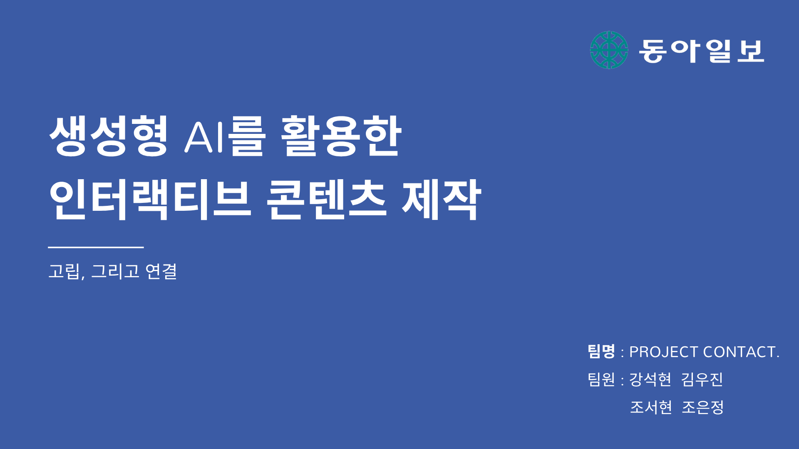 | 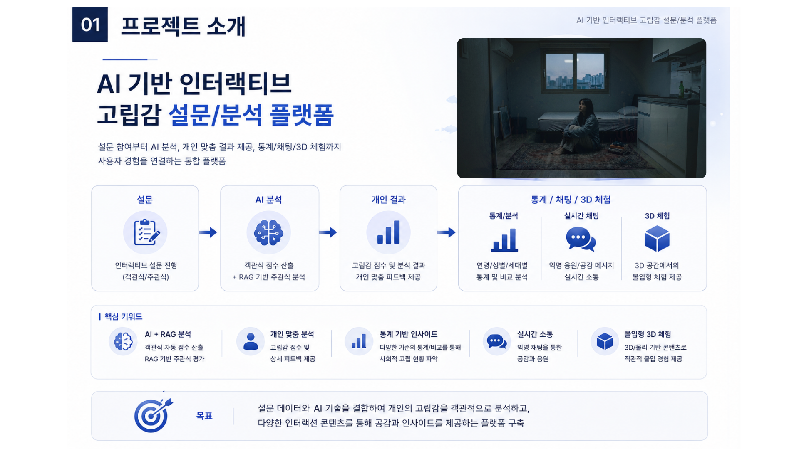 |
| :---: | :---: |
| 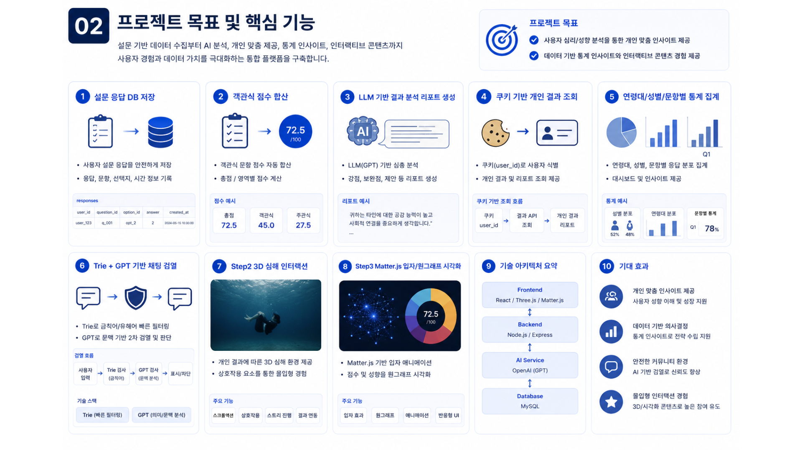 | 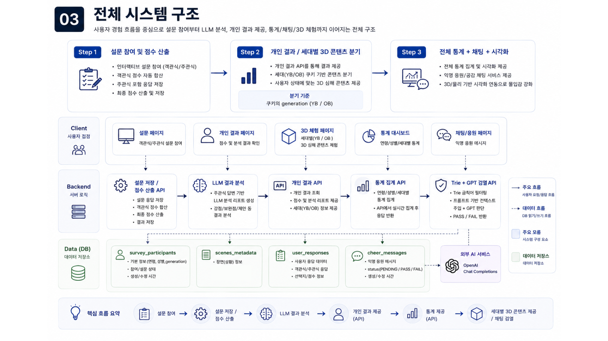 |
| 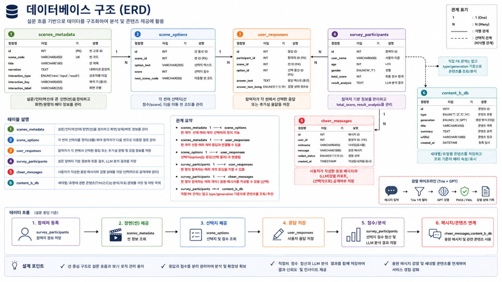 | 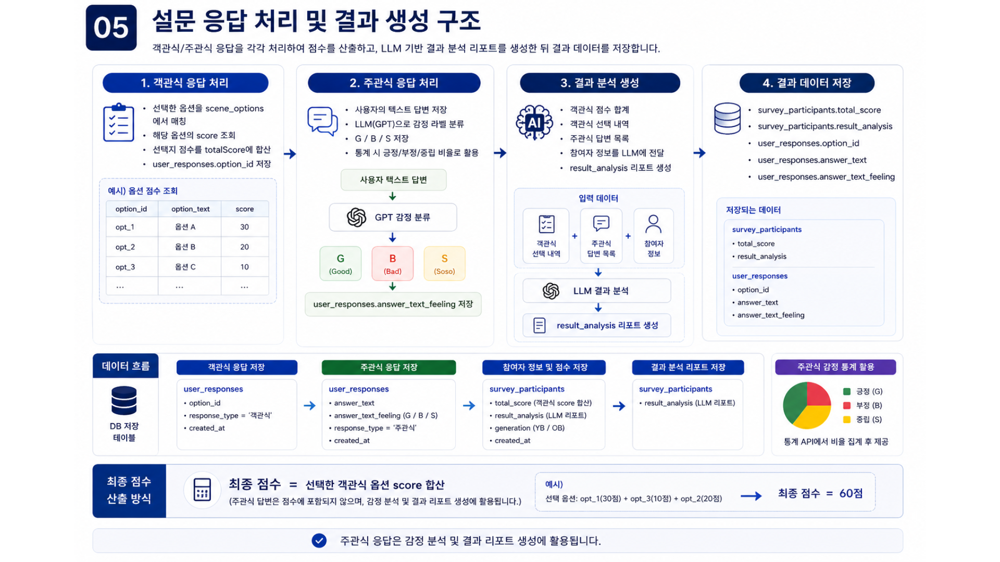 |
| 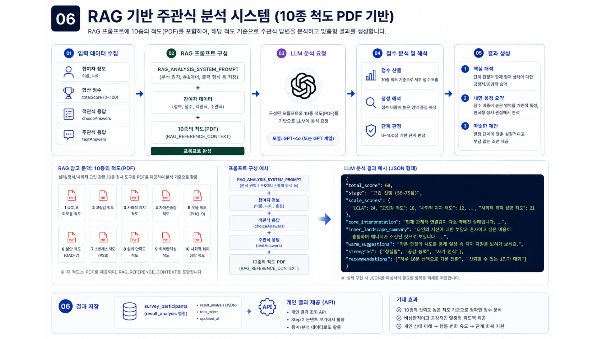 | 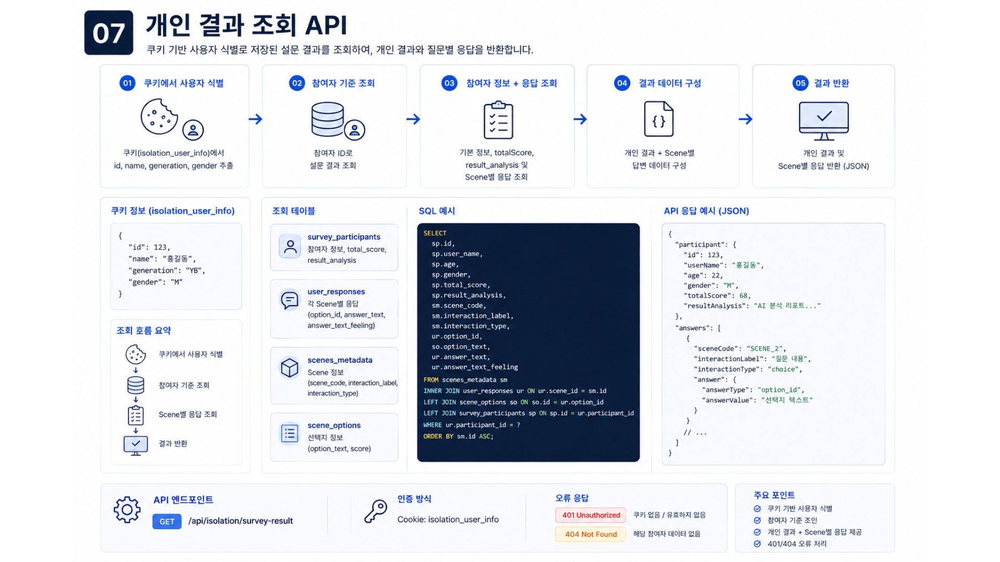 |
| 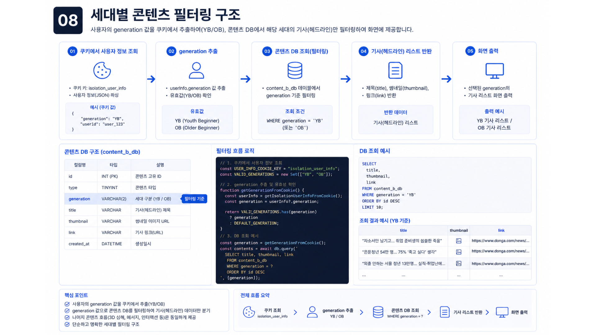 | 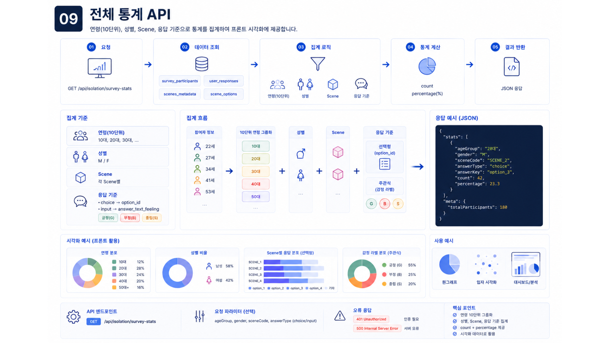 |
| 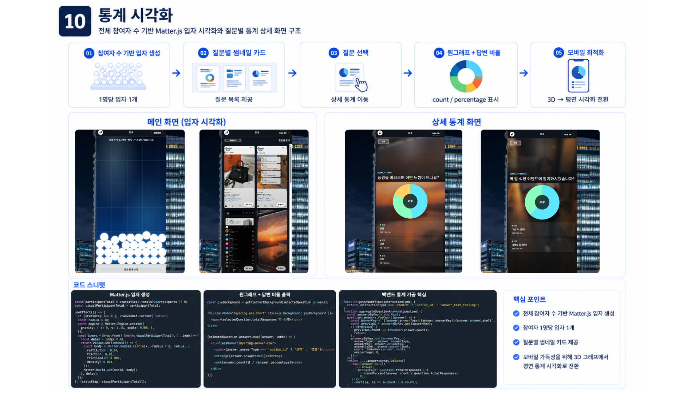 | 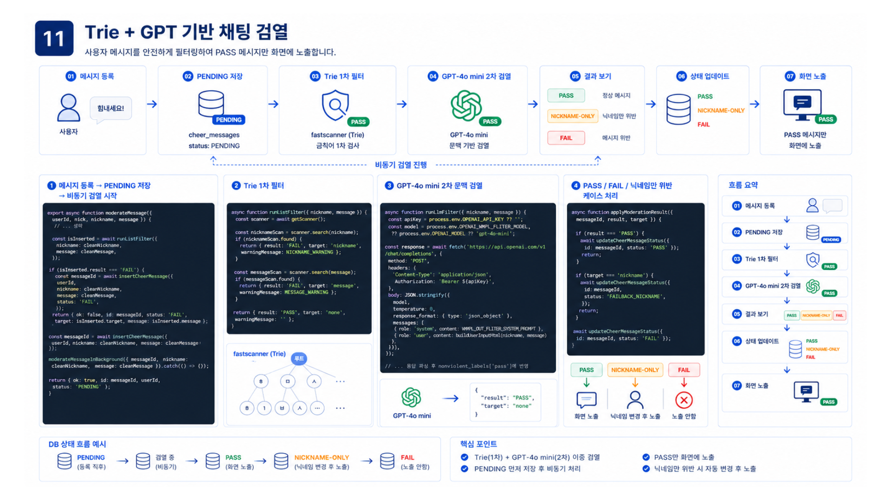 |
| 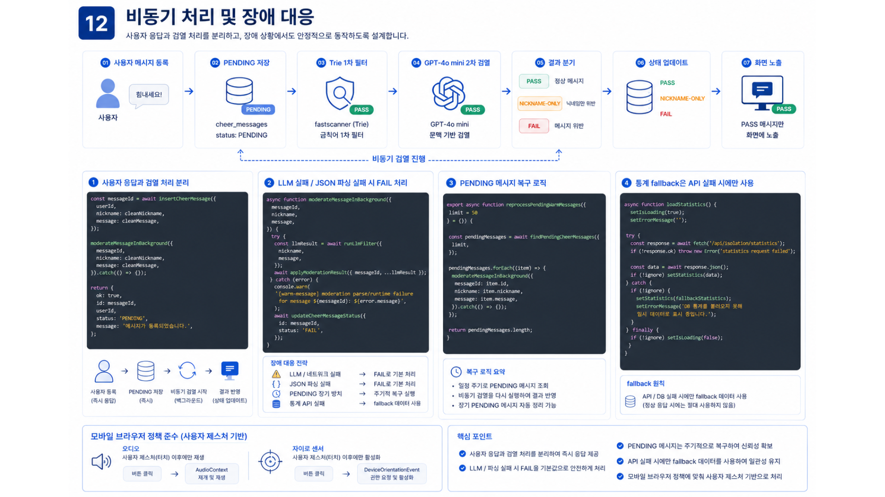 | 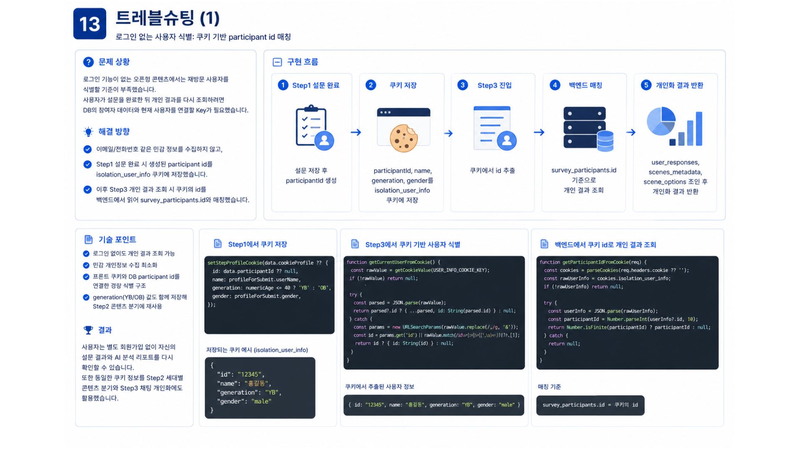 |
| 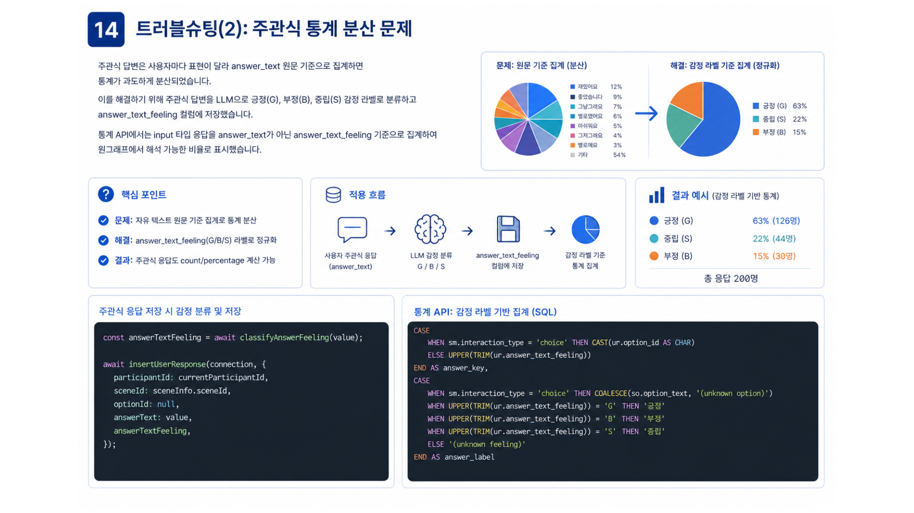 | 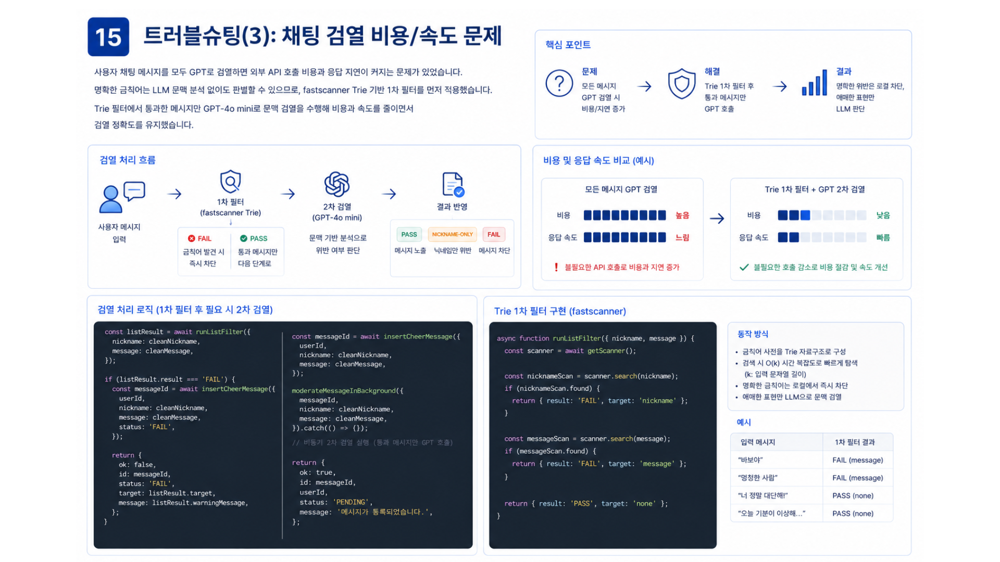 |
| 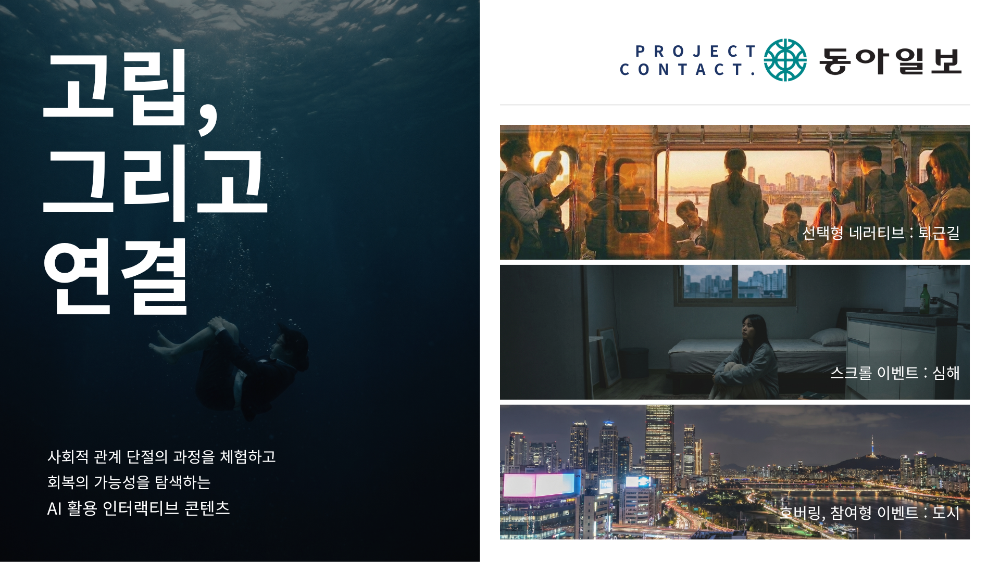 | 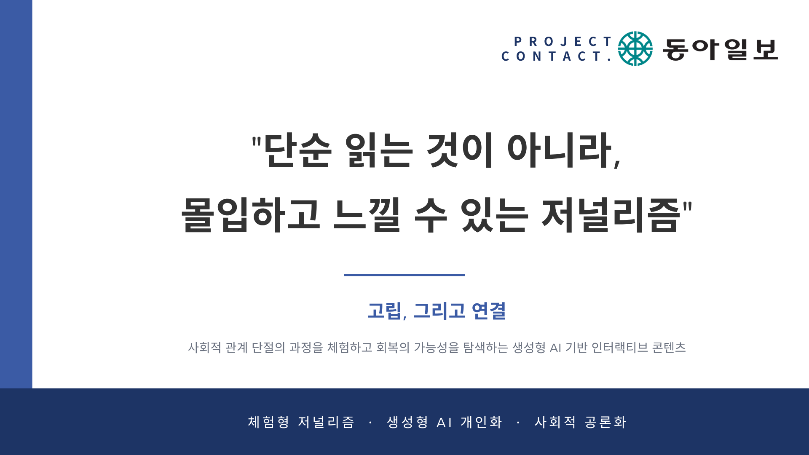 |

## ✨ 주요 기능

<b>1. 인터랙티브 설문 콘텐츠</b>: 사용자가 선택형 내러티브 흐름을 따라 설문에 참여하고, 객관식/주관식 응답을 DB에 저장하도록 구현함.

<b>2. AI 기반 결과 분석</b>: 사용자의 점수와 주관식 답변을 GPT-4o mini에 전달하여 개인화된 분석 리포트를 생성함.

<b>3. 쿠키 기반 개인 결과 조회</b>: 로그인 없이 `isolation_user_info` 쿠키의 participant id를 기준으로 개인 설문 결과를 다시 조회할 수 있도록 구현함.

<b>4. 3D 심해 인터랙션</b>: Three.js와 React Three Fiber를 활용해 고립감을 시각적으로 표현하는 심해형 3D 스크롤 콘텐츠를 구현함.

<b>5. 전체 통계 시각화</b>: 설문 응답 데이터를 연령대, 성별, Scene, 응답 기준으로 집계하고 원그래프와 Matter.js 입자 시각화로 표현함.

<b>6. Trie + GPT 채팅 검열</b>: fastscanner 기반 Trie 필터로 1차 금칙어 검열을 수행하고, 통과한 메시지만 GPT 문맥 검열을 진행하도록 구현함.

## 🚀 개선사항

<b>1. 검색형 RAG 구조 고도화</b>: 현재는 참고 문맥을 프롬프트에 직접 주입하는 Prompt-based RAG 방식이므로, 추후 `text-embedding-3-small`과 Vector DB를 활용한 검색형 RAG 구조로 확장할 수 있음.

<b>2. 관리자 페이지 도입</b>: 설문 응답, 통계 데이터, 채팅 검열 상태를 운영자가 직접 확인하고 관리할 수 있는 어드민 페이지를 추가하면 운영 효율을 높일 수 있음.

<b>3. 모바일 3D 성능 최적화</b>: Step2 심해 콘텐츠는 모바일 환경에서 프레임드랍이 발생할 수 있으므로, 기기 성능별 이펙트 단계 조절과 리소스 경량화를 추가로 개선할 예정임.

<b>4. 사용자 식별 안정성 강화</b>: 현재는 쿠키 기반 participant id로 개인 결과를 조회하므로, 추후 공유 링크 또는 일회성 복구 코드 등을 추가해 재방문 안정성을 높일 수 있음.